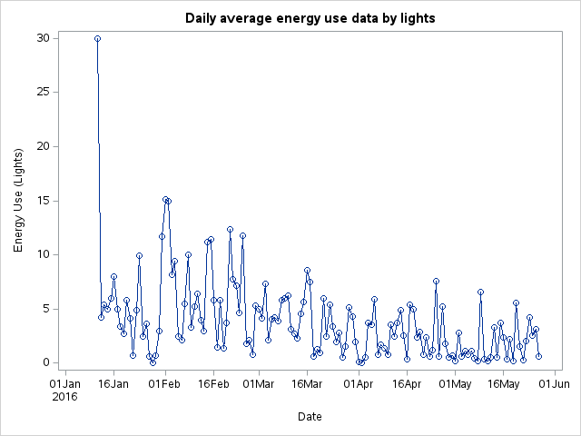
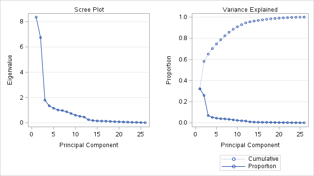
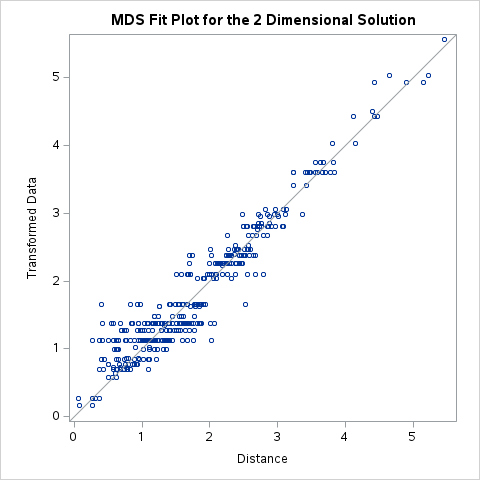
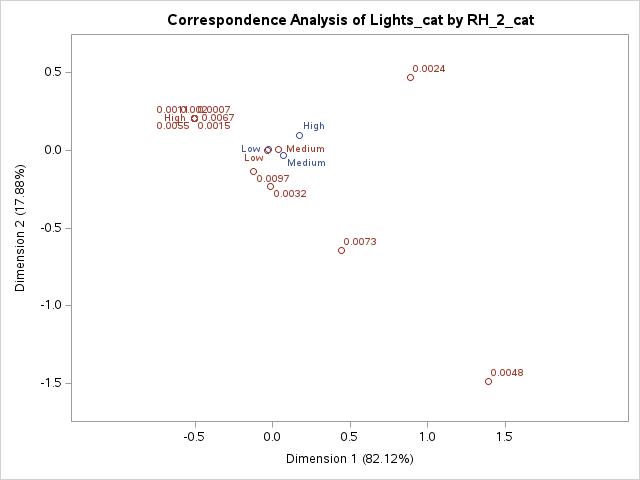
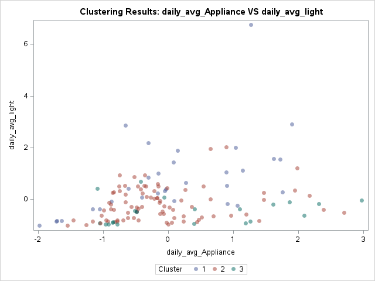
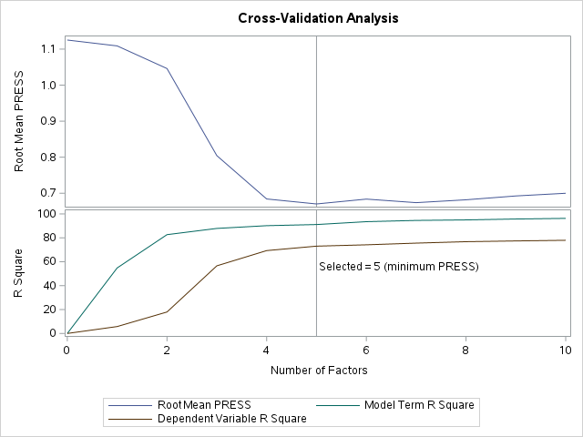
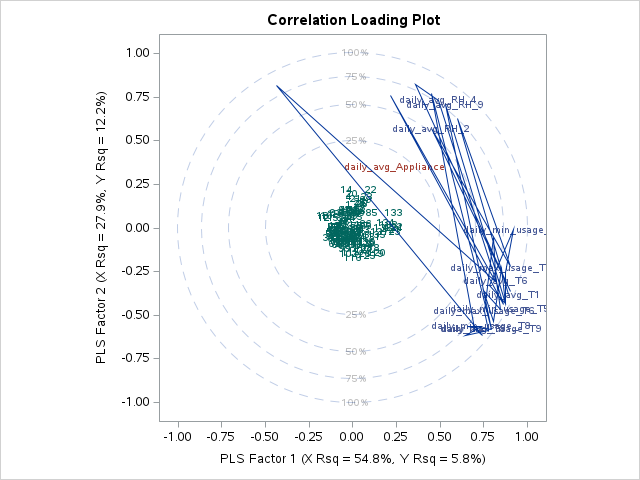

# Appliances Energy Prediction: A Multivariate Analytics Approach in SAS
An advanced statistical analysis and predictive modeling framework evaluating the relationships between indoor microclimates, outdoor meteorology, and domestic energy consumption within a low-energy residential building.

This project implements a comprehensive pipeline of multivariate statistical techniques in SAS using a high-frequency time-series dataset spanning 4.5 months (19,735 observations).

### 📌 Executive Summary

Effective energy management in sustainable, low-energy buildings requires deep insights into how environmental factors interact. This study models appliance and lighting energy consumption using 28 environmental and meteorological variables, including:

- Indoor room temperatures
- Relative humidity measurements
- Wind speed
- Visibility
- Dew point
- Outdoor weather conditions

### Key Analytical Achievements
#### 🔹 Dimensionality Reduction

Applied Principal Component Analysis (PCA) and Factor Analysis to extract latent environmental structures.

**Successfully separated climate profiles into:**
- Temperature Factors
- Humidity Factors
**Explained 53.97% of total structural variance.**
####  🔹 Predictive Modeling

Developed a Partial Least Squares (PLS) Regression model using 5 latent factors.

**Model performance:**

**91.11%** variance captured across predictors
**73.03%** variance explained for appliance energy consumption

#### 🔹 Model Validation

Cross-validation procedures confirmed predictive stability with:

- **Root Mean PRESS = 0.6702**

### 🛠 Project Objectives

- Profile appliance and lighting energy consumption patterns
- Analyze relationships between indoor microclimates and outdoor weather
- Build predictive frameworks for smart energy management systems
- Support intelligent HVAC and smart-grid optimization
  
### 🧠 Analytical Framework

       ┌──────────────────────────┐      ┌──────────────────────────┐
       │   Indoor Microclimates   │      │  Outdoor Weather Data    │
       │ (Temp & RH across rooms) │      │ (Wind, Dew, Visibility)  │
       └────────────┬─────────────┘      └────────────┬─────────────┘
                    │                                 │
                    └────────────────┬────────────────┘
                                     ▼
                      ┌─────────────────────────────┐
                      │    SAS Analytics Pipeline   │
                      │ (PCA, CCA, CDA, Clustering) │
                      └──────────────┬──────────────┘
                                     ▼
                      ┌─────────────────────────────┐
                      │   Predictive PLS Engine     │
                      │  (73.03% Variance Explained)│
                      └─────────────────────────────┘
### 📈 Results & Visualizations
**Energy Consumption Patterns**
**Daily Average Appliance Energy Use))**

_Figure 1: Daily average energy use by light fittings._

**Principal Components & Latent Structures**
**PCA Scree Plot**

_Figure 2: Scatter plot of the first two principal components._

**Relational Mapping**
**MDS Projection Plot**

_Figure 3: Multi-Dimensional Scaling structural arrangement._

**Correspondence Analysis Biplot**

_Figure 4: Mapping lighting profiles against humidity categories._

**Classification & Segmentation**
**Canonical Discriminant Analysis**

_Figure 5: Discriminant analysis group separation._

K-Means Clustering

_Figure 6: Behavioral energy consumption clusters._

**Predictive PLS Performance**
**PLS Cross Validation**

_Figure 7: Cross-validation performance across latent factors._

**PLS Correlation Loading Plot**

_Figure 8: Correlation loading plot of predictors vs consumption metrics._

### 🔬 Discussion & Limitations
Model Utility

This framework supports:

Smart building optimization
HVAC energy control
Predictive energy management
Sustainable infrastructure planning
Identified Constraints

Excluded variables:

Human occupancy behavior
Room overrides
Structural architectural factors

These represent future optimization opportunities.

Future Work

Potential extensions include:

Real-time IoT integrations
Deep learning forecasting models
Seasonal predictive systems
Smart-grid automation pipelines
📂 Repository Structure

├── src/
│   └── SAS analytical scripts
│
├── data/
│   └── Dataset access documentation
│
├── images/
│   └── Graphs, plots, and statistical visualizations
│
└── README.md

🚀 How to Reproduce in SAS
1. Clone the Repository
git clone <your-repository-url>
2. Load Dataset into SAS

Upload the dataset into:

SAS Studio
SAS Enterprise Guide
3. Configure Input Path

Update the dataset location inside the SAS macro header:

%let data_input = /your_directory/appliances_energy_prediction.csv;
4. Run the SAS Scripts

Execute the scripts sequentially to:

Generate statistical outputs
Produce diagnostic graphics
Build predictive models
🧰 Technologies Used
SAS
PCA
Factor Analysis
Canonical Correlation Analysis
Correspondence Analysis
Multidimensional Scaling
K-Means Clustering
Canonical Discriminant Analysis
Partial Least Squares Regression
📚 Citation

If you use this work in academic or professional research, please cite the original dataset source:

Candanedo, L. M., Feldheim, V., & Deramaix, D. (2017). Data driven prediction models of energy use of appliances in a low-energy house. Energy and Buildings, 140, 81–97.

👤 Author

Developed as part of an advanced multivariate analytics and predictive modeling study focused on sustainable energy systems and intelligent building analytics.
